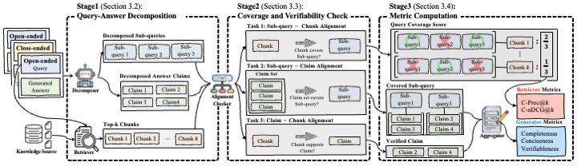

<div align="center">

# Q-CARE

**Q**uery **C**overage and cl**A**im ve**R**ifiability for RAG **E**valuation

**Towards Query-Agnostic RAG Evaluation via Query Coverage and Claim Verifiability**

Jeonghwan Choi · Taewon Yun · Minjeong Ban · Gyeonghun Sun · Jae-Gil Lee · Hwanjun Song

Korea Advanced Institute of Science and Technology (KAIST)

[](https://colmweb.org/)
[](LICENSE)
[](https://www.python.org/)

</div>

---

Q-CARE is a **query-agnostic**, fully **reference-free** framework for evaluating
retrieval-augmented generation. It decomposes queries into sub-queries and
answers into atomic claims, then scores retrieval and generation under one
principle — **query coverage** and **claim verifiability**. The same metrics
apply from close-ended fact-seeking to open-ended explanatory queries, and no
gold answer is needed at evaluation time.

<div align="center">

</div>

## 🔍 How it works

**Stage 1 · Decomposition.** A *decomposer* splits the query into minimal,
non-overlapping **sub-queries** and the answer into self-contained **atomic
claims**. Retrieval supplies the top-k chunks.

**Stage 2 · Coverage and verifiability.** An *alignment checker* asks three
questions, each a single yes/no judgement:

| Alignment | Question | Feeds |
|---|---|---|
| sub-query ↔ chunk | Does this chunk fully answer this sub-query? | C-Prec@k, C-nDCG@k |
| sub-query ↔ claim | Do the answer's claims cover this sub-query? | Completeness, Conciseness |
| claim ↔ chunk | Does any chunk support this claim? | Verifiableness |

**Stage 3 · Metrics.** Coverage is aggregated per query. A chunk that covers
more sub-queries counts as *more* relevant — the graded relevance that makes the
retrieval metrics coverage-aware — while claim-level coverage and support give
the generator metrics.

Because everything is grounded in the query's own sub-questions, the same
procedure works whether the query has one factual answer or needs a long
explanation, and a gold answer is never consulted.

## 📊 Metrics

<table>
<tr><th align="left" colspan="2">Retriever — coverage-aware</th></tr>
<tr><td><b>C-Prec@k</b></td><td>How much sub-query coverage do the top-k chunks provide?</td></tr>
<tr><td><b>C-nDCG@k</b></td><td>Are the chunks covering more sub-queries ranked higher?</td></tr>
<tr><th align="left" colspan="2">Generator — claim-level</th></tr>
<tr><td><b>Completeness</b></td><td>Does the answer address every sub-query?</td></tr>
<tr><td><b>Conciseness</b></td><td>Is every claim in the answer actually needed?</td></tr>
<tr><td><b>Verifiableness</b></td><td>Is every claim supported by a retrieved chunk?</td></tr>
</table>

## ⚙️ Install

```bash
git clone https://github.com/DISL-Lab/Q-CaRE-COLM-26.git
cd Q-CaRE-COLM-26
pip install -r requirements.txt
```

**What you need.** Everything runs locally against one open-weight backbone — no
API keys, and no corpus download, since the retrieved chunks ship with the
benchmark. The default backbone `Qwen/Qwen3-30B-A3B-Instruct-2507` is pulled
from HuggingFace on first use and takes roughly 70 GB in bf16; point
`CUDA_VISIBLE_DEVICES` at several GPUs and it shards automatically. On a smaller
card, pass a smaller instruction-tuned backbone — for example
`--eval_model meta-llama/Llama-3.1-8B-Instruct` — at some cost in agreement with
human judgement.

## 🚀 Quick start

One run evaluates **both halves of the RAG pipeline**: the same query
decomposition yields the retriever metrics for the chunks and the generator
metrics for the answer.

```bash
python evaluate.py \
  --input_path   data/testbed/test-close_ended_queries.json \
  --target_model GPT-5 \
  --output_dir   results
```

Each query yields the five metrics together with the intermediate judgements, so
a score can always be traced back to the sub-queries and claims behind it:

```jsonc
{
  "qid":          "nq_test_812",
  "query":        "who plays harley on stuck in the middle?",   // the original query
  "model_answer": "Jenna Ortega",                               // what is being evaluated

  // Stage 1 - decomposition
  "decomposed_query": {
    "Core subquery1": "Who is the actor who plays the character Harley in the TV show Stuck in the Middle?",
    "Core subquery2": "What is the name of the character played by Jenna Ortega in Stuck in the Middle?"
  },
  "atomic_facts": {
    "Atomic fact1": "Jenna Ortega plays the character Harley on the television show Stuck in the Middle."
  },

  // Stage 2 - alignment judgements (abridged)
  "relevance_check": {
    "query_chunk_coverage": { "Chunk 2": ["Core subquery1"] },
    "...": "..."
  },

  // Stage 3 - metrics
  "metrics": {
    // retriever
    "precision_at_10": 0.050,   // C-Prec@10
    "ndcg_at_10":      0.631,   // C-nDCG@10
    // generator
    "completeness":    0.500,
    "conciseness":     1.000,
    "verifiableness":  1.000
  }
}
```

Full benchmark for one model, then a per-dataset table:

```bash
bash scripts/run_benchmark.sh GPT-5 0 1        # close on GPU 0, open on GPU 1
python analysis/generator_benchmark.py --results_dir results
```

```
Model         Metric        NQ    NewsQA  HotpotQA   FinQA  Close Avg.
GPT-5         Comp.      0.755     0.687     0.758   0.163       0.591
GPT-5         Conc.      0.862     0.818     0.857   0.239       0.694
GPT-5         Veri.      0.600     0.787     0.690   0.599       0.669
```

<details>
<summary><b>Retriever-only mode</b></summary>

The run above already reports C-Prec@10 and C-nDCG@10 for the retriever it used.
When there is no generated answer to score — or the goal is to compare several
retrievers — this mode skips the answer-side steps, so it costs about half as
much and takes many retrievers at once. Conventional gold-chunk
Precision@10/nDCG@10 is computed alongside for reference.

```bash
python evaluate_retriever.py \
  --input_path  data/testbed/test-close_ended_queries.json \
  --retrievers  BM25,ANCE \
  --output_dir  results

python analysis/retriever_comparison.py --results_dir results
```
</details>

<details>
<summary><b>Interactive session</b></summary>

Loads the backbone once so each query scores in seconds — useful for inspecting
decompositions and judgements while adapting prompts.

```bash
CUDA_VISIBLE_DEVICES=0 python -i scripts/interactive.py
```
```python
>>> r = ev("nq_test_812")
>>> r["decomposed_query"]   # sub-queries
>>> r["atomic_facts"]       # claims
>>> r["relevance_check"]    # the alignment judgements
>>> r["metrics"]
```
</details>

<details>
<summary><b>Use it on your own data</b></summary>

```python
from qcare import Backbone, QCAREPipeline

pipeline = QCAREPipeline(Backbone().load())
result = pipeline.evaluate(
    qid="example-1",
    query="Who wrote Dune and when was it published?",
    answer="Dune was written by Frank Herbert and published in 1965.",
    chunks=["Dune is a 1965 science-fiction novel by Frank Herbert...", "..."],
)
print(result["metrics"])
```
</details>

## 🎛️ Customising

| What | How |
|---|---|
| **Prompts** | Edit [`configs/prompts.yaml`](configs/prompts.yaml), or `--prompts my_prompts.yaml` |
| **Backbone** | `--eval_model <model id>` — any **instruction-tuned** chat model with a tokenizer chat template. The paper evaluates Qwen3-30B, Qwen3-80B, Llama3.1-8B and Llama3.3-70B as backbones |
| **Retriever** | `--retrieval_method ANCE` — BM25 and ANCE ship with the benchmark |
| **Parsing** | `--parsing paper` reproduces the published behaviour; `strict` never double counts a claim |

<details>
<summary><b>Benchmark your own model or retriever</b></summary>

**Your model** — generate its answers over the same queries and chunks, then score:

```bash
python scripts/generate_answers.py \
  --input_path  data/testbed/test-close_ended_queries.json \
  --output_path data/testbed/test-close_ended_queries+mymodel.json \
  --model meta-llama/Llama-3.1-8B-Instruct --model_key MyModel

python evaluate.py \
  --input_path data/testbed/test-close_ended_queries+mymodel.json \
  --target_model MyModel
```

**Your retriever** — add its ranked chunks under a new key. Only chunk texts are
needed; no index or corpus has to be shared.

```python
record["retrieved_chunk"]["MyRetriever"] = my_search(record["query"], k=10)
```
```bash
python evaluate_retriever.py --retrievers MyRetriever,BM25 ...
```
</details>

## 📦 Benchmark data

`data/testbed/` holds **800 queries** — 400 close-ended (NQ, NewsQA, HotpotQA,
FinQA) and 400 open-ended (PubMedQA, LoTTE-Science, LoTTE-Technology, ELI5).
Each record carries the query, the gold answer, the top-30 retrieved chunks for
BM25 and ANCE, and the answers of eight target models. **Chunks are stored
inline, so evaluation needs no corpus download.**

`data/human_labels/` contains the human annotations collected for the alignment
tasks and the Q-CARE scores derived from them — see
[`data/human_labels/README.md`](data/human_labels/README.md).

## 🗂️ Repository layout

```
evaluate.py                 score a target model (retriever + generator metrics)
evaluate_retriever.py       retriever-only evaluation
configs/prompts.yaml        every prompt the pipeline uses
qcare/
  backbone.py               model loading and generation
  prompts.py                prompt loading and rendering
  pipeline.py               decomposition, alignment checks, scoring
  parsing.py                response parsers
  metrics.py                metric definitions
  data.py                   benchmark access helpers
analysis/                   per-dataset table, retriever ranking, human agreement
scripts/                    benchmark runner, answer generation, interactive session
docs/REPRODUCE.md           reproducing the paper's tables
```

## 📄 Citation

```bibtex
@inproceedings{choi2026qcare,
  title     = {Towards Query-Agnostic {RAG} Evaluation via Query Coverage and Claim Verifiability},
  author    = {Choi, Jeonghwan and Yun, Taewon and Ban, Minjeong and
               Sun, Gyeonghun and Lee, Jae-Gil and Song, Hwanjun},
  booktitle = {Conference on Language Modeling (COLM)},
  year      = {2026}
}
```

## ⚖️ License

Released under the MIT License — see [LICENSE](LICENSE).
